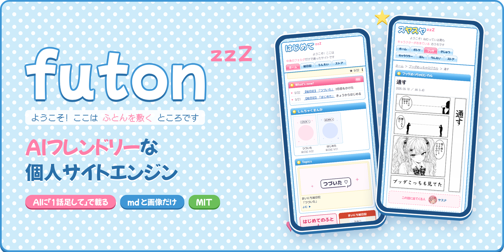
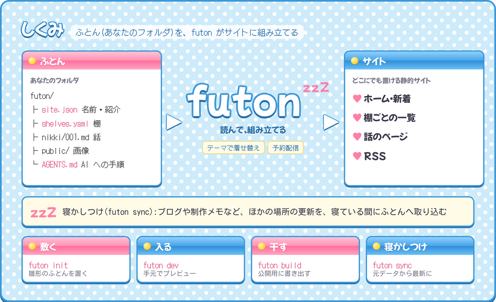
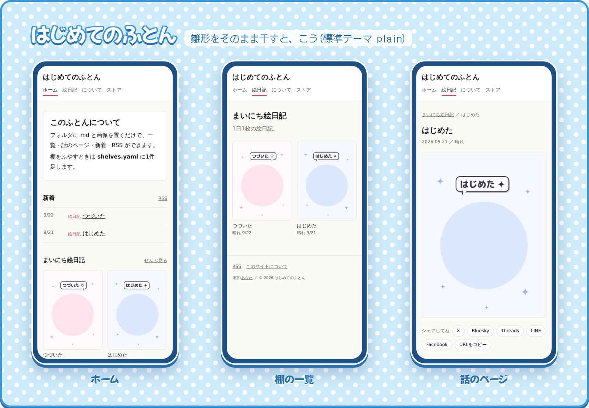
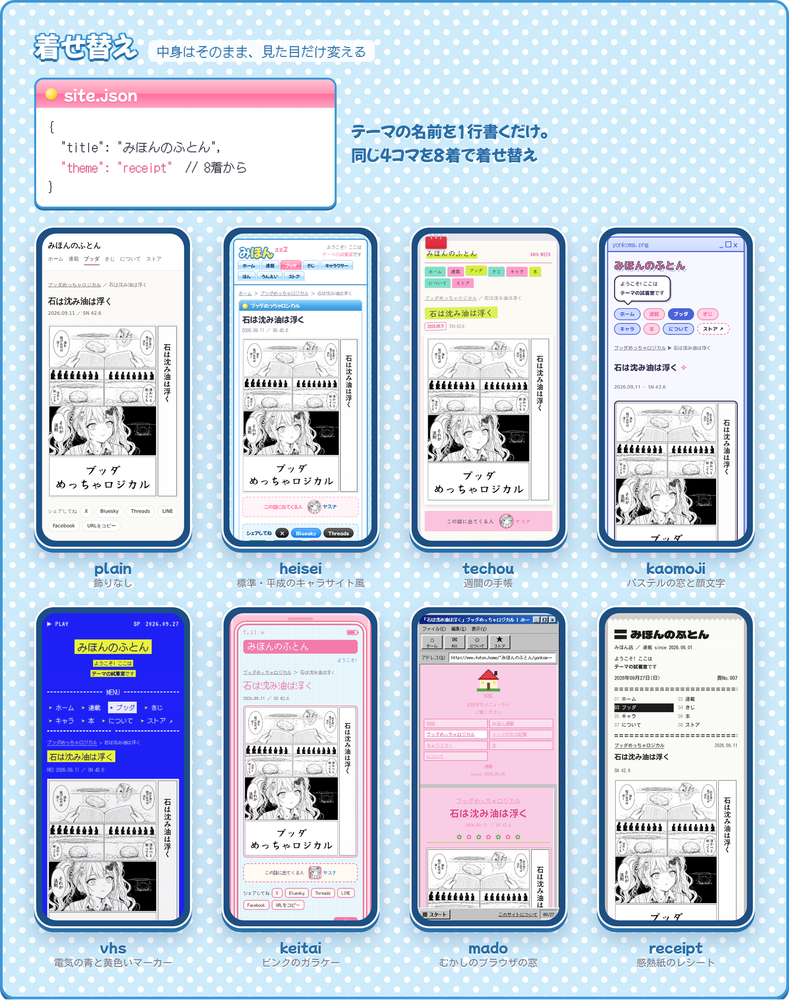
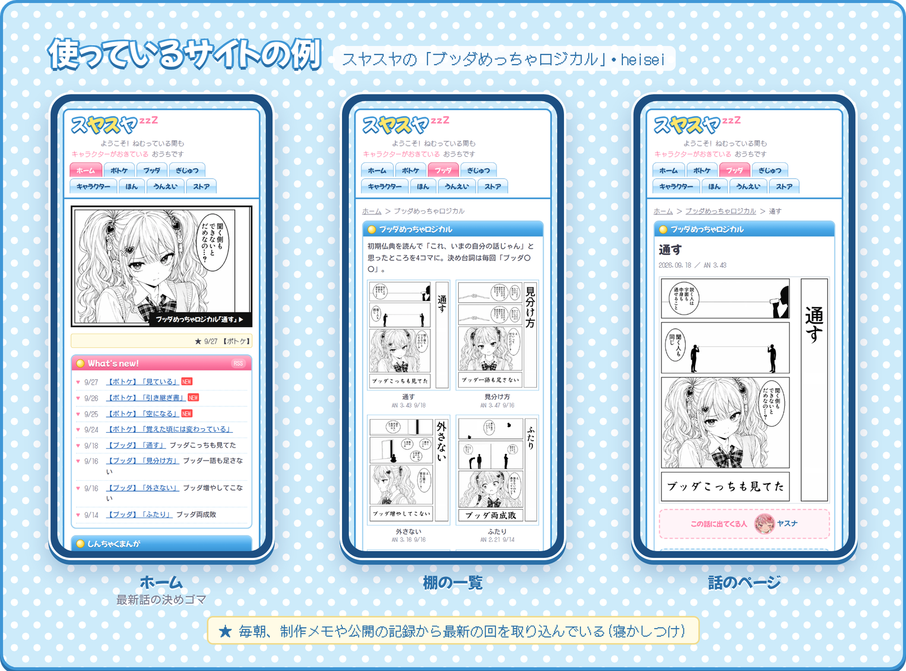

# futon

[English](README.md) / 日本語

<p align="center"></p>

**AIフレンドリーな個人サイトエンジン。**
中身は md と画像と設定ファイルだけ。AI に「1話足して」「この回を伏せて」と頼めば、そのまま載る。
ふとん(中身のフォルダ)を敷いておくと、寝ている間に自分のホームページが整う。

- **AI に頼みやすい。** 中身はコードではなく、決まった形の md と json。雛形に AI 向けの手順書(`AGENTS.md`)がついていて、Claude Code などに話しかけるだけで更新できる
- **中身はぜんぶ手元のファイル。** md と画像と設定ファイルだけ。やめても何も失わない
- **連載のための棚。** 話を1本足すと、一覧・話のページ・新着・RSS が全部つくり直される。日付を未来にすれば予約配信
- **寝かしつけ。** ブログや制作メモなど、ほかの場所の更新を取り込んで最新にする(`futon sync`)。毎朝の定期実行に向いている
- **着せ替え。** 見た目はテーマ。中身はそのまま、1行で着せ替える

## しくみ

<p align="center"></p>

## はじめる

```bash
npm create futon@latest my-site   # ふとんを敷く(my-site/futon に雛形「はじめてのふとん」)
cd my-site
npm install
npm run dev                       # ふとんに入る(http://localhost:4321 でプレビュー)
npm run build                     # ふとんを干す(dist/ に書き出す。どこにでも置ける静的サイト)
```

テーマを決めて敷くなら `npm create futon@latest my-site -- --theme techou`。
敷いたあとは、そのフォルダの中で `npx futon …` が使える:

```bash
npx futon sync --dry …   # 寝かしつけ(元データから最新にする。--dry で確認だけ)
npx futon add <棚> …     # 1話足す
```

(npm の `futon` という名前は別の人のパッケージ。futon は `@yasuna/futon` なので、
入れていないフォルダで `npx futon` と打たないこと。今あるプロジェクトに足すなら `npm i @yasuna/futon` して `npx futon init`)

フォルダは引数(`futon dev ./mysite`)か環境変数 `FUTON` で渡す。どちらもなければ `./futon`。Node.js 22.18 以上。

雛形をそのまま干すと、こうなる(標準テーマ heisei):

<p align="center"></p>

## 着せ替え

<p align="center"></p>

futon には8着ついてくる。`site.json` に名前を1行書くだけで着られる。

| テーマ | 見た目 |
|---|---|
| `heisei`(標準) | 平成のキャラクターサイト風。`theme` を書かなければこれ。ドットの背景・ロゴ・タブ・ティッカー・バナー・キャラクターしょうかい・本。書くと出る欄は [`themes/heisei/README.md`](themes/heisei/README.md) |
| `plain` | 飾りのない、読みやすさだけのテーマ |
| `techou` | 週間の手帳。左はウィークリー(新着)、右は方眼にキャラのスタンプとまんがのシール。蛍光マーカーと赤いダブルクリップ。[`themes/techou/README.md`](themes/techou/README.md) |
| `kaomoji` | パステルのデスクトップの窓と、顔文字のふきだし。新着はチャット、キャラはふきだしでしゃべる。暗い画面では夜のデスクトップ |
| `vhs` | 電気みたいな青に黄色いマーカー、ビデオデッキのメニュー画面。キャラは PLAYER SELECT、404 は黄緑の ERR0R 画面 |
| `keitai` | ピンクのガラケー。メニューは数字キー、新着はメール、キャラはアドレス帳。暗い画面では黒い本体 |
| `mado` | むかしのブラウザの窓に、左右フレームのピンクのホームページ。タスクバーつき、404 は「ページを表示できません」 |
| `receipt` | 感熱紙のレシート。新着は領収証の品目、キャラは会員情報、下にバーコード。キャラの絵を落書きのように重ねる |

`site.json` に `"lang": "en"` と書くと、どのテーマもメニュー・見出し・ボタンが英語になる。

文字もその時代に寄せている(mado・keitai はドットの字、heisei・mado の見出しは創英角ポップ体風、本文は当時の MS Pゴシック / Osaka があればそれを使う)。

自分で作ったテーマや配られたテーマは、ふとんの中に置いて `"theme": "./themes/<名前>"`。作り方は下の「テーマ(着せ替え)」。

## 使っているサイトの例

<p align="center"></p>

キャラクターサイト「スヤスヤ」。4コマ「ブッダめっちゃロジカル」や豆大福ポトケの連載を、futon とテーマ `heisei` で建てている。
毎朝の定期実行で `futon sync` を流し、制作メモや公開の記録から最新の回を取り込んでいる。

## ふとん(中身のフォルダ)

| ファイル | 何 |
|---|---|
| `site.json` | `lang`(テーマの言葉。`"ja"` か `"en"`)・`labels`(テーマの言葉を1語ずつ変える。例 `{ "ホーム": "トップ" }`)・`menu`(メニューに足すリンク。例 `[{ "label": "おといあわせ", "href": "https://forms.gle/…" }]`。外のサイトは新しいタブで開く)・`store` / `storeName`(おみせのリンクと、その呼び名。例 `"storeName": "〇〇の本屋"`)・サイトの名前・ロゴ・あいさつ・運営者・フィードの宛先(note / Zenn)・紹介文・キャラクター・本・動画・Xの埋め込み・追加ページ・`theme`・`noindex`・`url`・`imageBase`(`futon add` / `sync` が画像を取りに行く先)・記事の呼び方(`tech: { label, tab, lead, description }`) |
| `shelves.yaml` | まんがの棚(シリーズ)。1件足すと一覧・話のページ・メニュー・ホーム・RSS に出る。`- group: <key>` の行で棚をまとめられる(メニューのタブが1つになり、`/<key>/` に棚がならぶ)。書き方は雛形の先頭に |
| `<棚>/*.md` | 話。`date` が未来なら、その日のビルドまで出ない(予約配信)。`hidden: true` で伏せる。`cast` で「この話に出てくる人」を1話だけ変えられる |
| `tech/*.md` | 技術記事(あれば) |
| `about.json` | 運営についてのページ。連絡先は `contactForm`(フォームのURL。ボタンで出る)か `contact`(文字で出る) |
| `guidelines/*.md` | ページに埋め込む文章(二次創作ガイドラインなど) |
| `public/` | 画像・音声・favicon |
| `pages/<名前>.astro` | 追加ページ。`site.json` の `extraPages: { "<URL>": "<名前>" }` に書いたものだけ出る。外枠は `@theme/Base.astro`、部品は `@futon/…` で読む |
| `sources/*.mjs` | 取り込み口。置くだけで `futon sync` が使う(下) |

キャラクターと本と話は、`slug` でつながる。

- `site.json` の `characters[]` に `slug`(と、あれば顔のアイコン `face`)を書く
- 本は `books[].characters: ["slug", …]` で、本に顔、キャラに「でてくる本」が出る
- 棚は `shelves.yaml` の `cast: [slug, …]` で、話のページに「この話に出てくる人」が出る

## 取り込み口(sync)

`futon sync` は、取り込み口を順に呼んで、足りない回を足し、変わった題や日付を直す。何度流しても同じ結果。
取り込み口は1ファイル1元データで、次の形のモジュール:

```js
export const flag = "desk";                 // futon sync --desk <値> で呼ばれる
export const series = "buddha";             // どの棚に入れるか
export const help = "--desk <制作卓.html>";
export async function sync(ctx, value, args) {
  // 元データを読んで ctx.add(棚, 話, ラベル) で足す/ctx.patch(今の話, 変更, ラベル) で直す/ctx.report に書く
}
```

エンジンには技術ブログ(Lume)の取り込み口 `--tech <リポジトリ>` が入っている。
画像を取れない環境では足す回を `sync/pending.json` に積み、`futon fetch-pending` で後から足せる。

## テーマ(着せ替え)

見た目は全部テーマが持つ。`site.json` の `"theme"` に、ついてくるテーマの名前(`"heisei"` / `"plain"` / `"techou"` / `"kaomoji"` / `"vhs"` / `"keitai"` / `"mado"` / `"receipt"`)か、ふとんからの相対パス(`"./themes/mine"`)か、パッケージ名を書く。
書かなければ標準の **heisei**。
`FUTON_THEME=<テーマ> futon build` で、site.json を変えずにそのときだけ着せ替えて見られる。

テーマは次の .astro を持つフォルダ(またはパッケージ):

| ファイル | 何 | 受け取るもの(props) |
|---|---|---|
| `Base.astro` | 外枠(ヘッダー・メニュー・フッター) | `title` `description` `tab` `image` |
| `Home.astro` | ホーム | なし |
| `ShelfIndex.astro` | 棚の一覧 | `s`(棚) |
| `GroupIndex.astro` | グループ(棚をまとめたもの)のページ。無ければエンジンの標準のもの | `g`(グループ。`g.shelves` に棚) |
| `Episode.astro` | 話のページ | `s` `e`(話) `newer` `older` |
| `TechIndex.astro` / `TechPost.astro` | 記事の一覧/記事 | なし / `p`(記事) `newer` `older` |
| `About.astro` / `Privacy.astro` / `NotFound.astro` | について/このサイトについて/404 | なし |

中身はエンジンの部品から読む:`@futon/lib/content`(`episodes` `newest` `techPosts` `site` `url` `md` `dotted` …)、
`@futon/lib/series`(棚。メニューは `shelfNav(url)`、ページのタブは `tabOf(s)` を使うとグループにまとまる)、`@futon/lib/futon`(`readFutonJson` `hasTech`)、`@futon/components/Share.astro` / `Tweet.astro` / `Analytics.astro`。
ふとんの追加ページ(`pages/*.astro`)からは、テーマの外枠を `@theme/Base.astro` で読める。

作ったら試着する:`node tools/try.mjs`(`themes/` の全部)か `node tools/try.mjs <名前>`。
全部の欄を使う見本(`samples/showcase/`「みほんのふとん」)を着せてビルドし、ページがそろっているか確かめる。できたサイトは `out/<名前>/`。
テーマに出す言葉は `@futon/lib/i18n` の `tr("…")` で包む(日本語で書き、英語は `engine/src/lib/i18n/en.json` に足す)。テーマの中に特定のサイトの文言を書かない。サイトごとに変わる言葉は site.json から読んで、なければ汎用の文言にする。

## 棚の形

- `sheets` … 画像を何枚か並べて読む(右列・左列・札)
- `single` … 1枚で読む(4コマなど)

新しい形は `engine/src/lib/series.ts` と `lib/lib.mjs` の `formats` に足す。

## 中のつくり

- `bin/futon.mjs` … コマンド
- `engine/` … Astro のサイト。どの URL にどのテーマ部品を出すかと、ふとんの読み込みだけを持つ(見た目は持たない)
- `themes/*/` … ついてくるテーマ(plain・heisei・techou・kaomoji・vhs・keitai・mado・receipt)
- `samples/showcase/`・`tools/try.mjs` … テーマの試着用の見本と、試着の道具
- `lib/` … sync・add・画像の取り込み
- `starter/` … `futon init` / `npm create futon` で敷く雛形(はじめてのふとん)
- `create/` … `npm create futon` の中身(create-futon)
- `docs/` … README の画像(日本語は `docs/images/`、英語は `docs/images/en/`)とロゴ(`docs/images/logo.png`。文字だけのロゴ)


## ライセンス

MIT(`LICENSE`)。エンジン・ついてくるテーマ(plain・heisei・techou・kaomoji・vhs・keitai・mado・receipt)・雛形・見本を含む。
見本(`samples/showcase/`)の**ヤスナとのんたんの絵と4コマ「ブッダめっちゃロジカル」(`samples/showcase/public/img/`)も MIT の対象外**(© 2026 yasuna)。テーマの試着に使うためだけに置いている。
README の画像に写っている作品(漫画・キャラクター)も同じく MIT の対象外。
テーマ mado・keitai に同梱のドットのフォント PixelMplus は M+ FONT LICENSE(`themes/*/fonts/LICENSE.txt`)。
ふとん(利用者の中身)と、別に配られるテーマ(futon-theme など)は、それぞれの持ち主の条件にしたがう。
