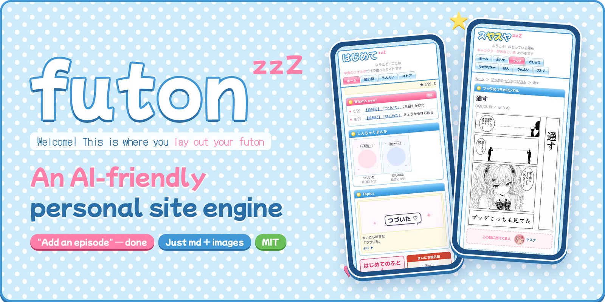
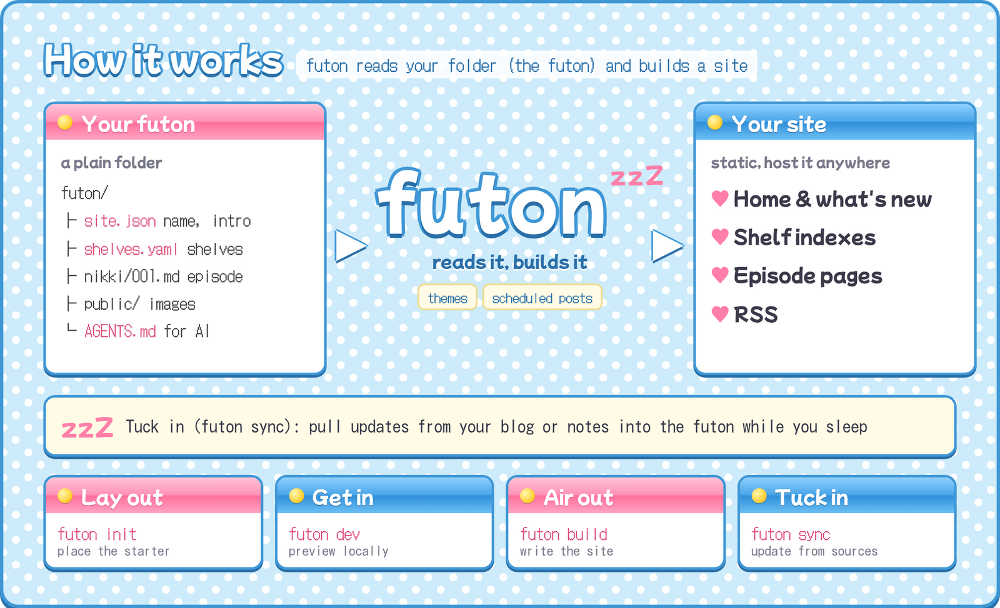
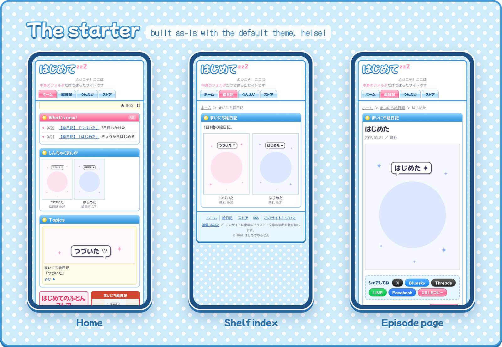
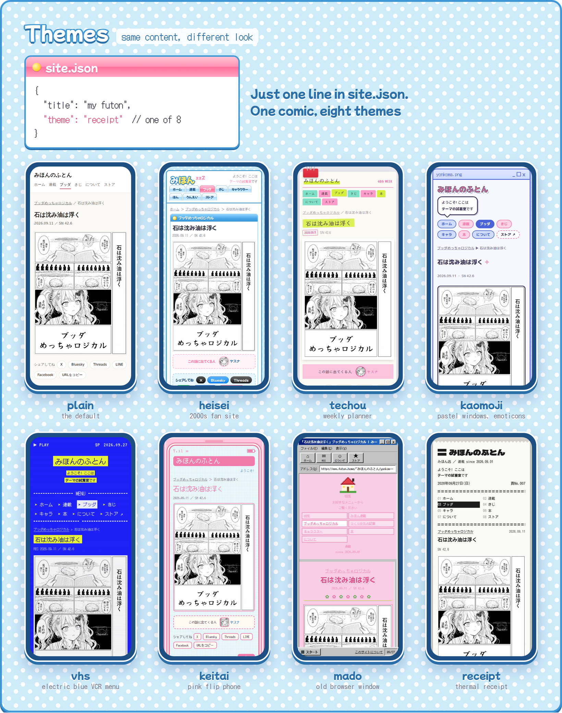
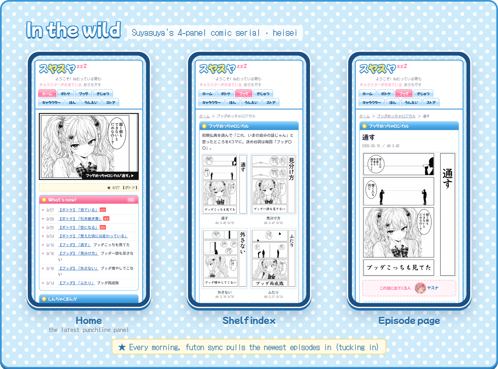

# futon

English / [日本語](README.ja.md)

<p align="center"></p>

**An AI-friendly personal site engine.**
Your content is just Markdown, images and a couple of settings files. Ask an AI "add episode 12" or "hide this one", and it goes live as-is.
Lay out your *futon* (the content folder), and your homepage tidies itself up while you sleep.

- **Easy to hand to an AI.** Content isn't code — it's Markdown and JSON in a fixed shape. The starter ships with instructions for AI agents (`AGENTS.md`), so you can update your site just by talking to Claude Code or similar tools
- **Everything lives in your own files.** Markdown, images and settings. Stop using futon any time and you lose nothing
- **Shelves for serials.** Add one episode and the index, episode page, "what's new" and RSS are all rebuilt. Give it a future date and it's scheduled
- **Tucking in (sync).** Pull updates from elsewhere — your blog, production notes — into the site (`futon sync`). Made for a nightly/morning cron
- **Dress-up (themes).** The look is a theme. Keep the content, switch the look with one line

For an English site, add `"lang": "en"` to `site.json`: every theme's menus, headings and buttons switch to English. Change any single word with `"labels": { "ホーム": "Top" }`. Everything specific to your site (titles, intro, shelves, episodes) comes from your own files, so write it in any language. The starter's sample text is Japanese.

## How it works

<p align="center"></p>

futon's commands follow the bedding metaphor:

| Verb | Command | What it does |
|---|---|---|
| lay out (敷く) | `futon init` | put the starter futon in place |
| get in (入る) | `futon dev` | preview locally |
| air out (干す) | `futon build` | write the static site to `dist/` |
| tuck in (寝かしつけ) | `futon sync` | pull the latest from your sources |

## Getting started

```bash
npm create futon@latest my-site   # lay out a futon (starter "はじめてのふとん" in my-site/futon)
cd my-site
npm install
npm run dev                       # get in (preview at http://localhost:4321)
npm run build                     # air out (static site in dist/, host it anywhere)
```

To pick a theme up front: `npm create futon@latest my-site -- --theme techou`.
Inside that folder you can also use `npx futon …`:

```bash
npx futon sync --dry …   # tuck in (update from sources; --dry just reports)
npx futon add <shelf> …  # add one episode
```

(The npm name `futon` belongs to someone else's package. futon is `@yasuna/futon`, so don't run `npx futon` in a folder where it isn't installed. To add it to an existing project: `npm i @yasuna/futon`, then `npx futon init`.)

The content folder is taken from the argument (`futon dev ./mysite`) or the `FUTON` environment variable, defaulting to `./futon`. Requires Node.js 22.18+.

The starter, built as-is with the default theme `heisei`:

<p align="center"></p>

## Themes (dress-up)

<p align="center"></p>

futon ships with eight themes. Put the name in `site.json` and you're wearing it.

| Theme | Look |
|---|---|
| `heisei` (default) | A 2000s Japanese character fan site — used when `theme` is omitted: polka dots, outlined logo, aqua tabs, ticker, banners, character profiles, books. Fields it reads: [`themes/heisei/README.md`](themes/heisei/README.md) |
| `plain` | No decoration, just readable |
| `techou` | A weekly planner spread: the left page is a week of new posts, the right is grid paper with character stamps and comic stickers. Highlighter pens and red binder clips |
| `kaomoji` | Pastel desktop windows and emoticon speech bubbles. New posts are a chat; characters talk in bubbles. Night desktop in dark mode |
| `vhs` | Electric blue with yellow highlighter, a VCR menu screen. Characters are a PLAYER SELECT; the 404 is a lime ERR0R screen |
| `keitai` | A pink flip phone: number-key menu, new posts as "new mail", characters as an address book. Black handset in dark mode |
| `mado` | An old browser window around a pink two-frame homepage, with a taskbar; the 404 is "The page cannot be displayed" |
| `receipt` | A thermal-paper receipt: new posts are line items, characters are "member info", with a barcode at the bottom and a character doodled over it |

Fonts lean into each era too (pixel fonts for `mado` and `keitai`, a pop-style display face for `heisei` and `mado`, and MS PGothic / Osaka for body text when installed).

To use your own or a distributed theme, put it in your futon and set `"theme": "./themes/<name>"`. See "Writing a theme" below.

## A site that uses it

<p align="center"></p>

"Suyasuya", a Japanese character site, runs its 4-panel comic serials on futon with the `heisei` theme.
A scheduled job runs `futon sync` every morning to pull the newest episodes from production notes and publishing logs.

## The futon (your content folder)

| File | What |
|---|---|
| `site.json` | `lang` (`"ja"` or `"en"` for the theme's words), `labels` (rename any theme word), site name, logo, greeting, owner, feeds (note / Zenn), intro, characters, books, videos, embedded posts, extra pages, `theme`, `noindex`, `url`, `imageBase` (where `futon add` / `sync` fetch images), and what to call articles (`tech: { label, tab, lead, description }`) |
| `shelves.yaml` | Comic shelves (series). Add one and it appears in the index, episode pages, menu, home and RSS. A `- group: <key>` line groups shelves (one menu tab, shelves listed at `/<key>/`). The starter's header explains the format |
| `<shelf>/*.md` | Episodes. A future `date` stays hidden until the build on that day (scheduling). `hidden: true` hides one. `cast` overrides "who's in this episode" for one episode |
| `tech/*.md` | Articles (optional) |
| `about.json` | The "about" page. For contact, `contactForm` (a form URL, shown as a button) or `contact` (shown as text) |
| `guidelines/*.md` | Text embedded in pages (fan-art guidelines, etc.) |
| `public/` | Images, audio, favicon |
| `pages/<name>.astro` | Extra pages. Only those listed in `site.json` `extraPages: { "<url>": "<name>" }` are built. Use `@theme/Base.astro` for the frame and `@futon/…` for parts |
| `sources/*.mjs` | Sources. Drop one in and `futon sync` uses it (below) |

Characters, books and episodes are linked by `slug`:

- give each entry in `site.json` `characters[]` a `slug` (and optionally a face icon, `face`)
- `books[].characters: ["slug", …]` puts faces on the book and "appears in" on the character
- `cast: [slug, …]` on a shelf in `shelves.yaml` adds "who's in this episode" to episode pages

## Sources (sync)

`futon sync` calls each source in turn, adds missing episodes and fixes changed titles or dates. Running it twice gives the same result.
One source per file, one upstream per source:

```js
export const flag = "desk";                 // called as futon sync --desk <value>
export const series = "buddha";             // which shelf it fills
export const help = "--desk <desk.html>";
export async function sync(ctx, value, args) {
  // read the upstream; ctx.add(shelf, episode, label) to add / ctx.patch(current, changes, label) to fix / write to ctx.report
}
```

The engine includes a source for a Lume tech blog: `--tech <repo>`.
Where images can't be fetched, episodes to add are queued in `sync/pending.json`; add them later with `futon fetch-pending`.

## Writing a theme

A theme owns the whole look. Set `"theme"` in `site.json` to a bundled name (`"heisei"` / `"plain"` / `"techou"` / `"kaomoji"` / `"vhs"` / `"keitai"` / `"mado"` / `"receipt"`), a path relative to your futon (`"./themes/mine"`), or a package name.
Omit it for **heisei**.
`FUTON_THEME=<theme> futon build` tries a theme once without touching `site.json`.

A theme is a folder (or package) with these .astro files:

| File | What | Props |
|---|---|---|
| `Base.astro` | Frame (header, menu, footer) | `title` `description` `tab` `image` |
| `Home.astro` | Home | none |
| `ShelfIndex.astro` | Shelf index | `s` (shelf) |
| `GroupIndex.astro` | Group page (shelves grouped together). Optional — the engine falls back to a default | `g` (group; shelves in `g.shelves`) |
| `Episode.astro` | Episode page | `s` `e` (episode) `newer` `older` |
| `TechIndex.astro` / `TechPost.astro` | Article index / article | none / `p` (article) `newer` `older` |
| `About.astro` / `Privacy.astro` / `NotFound.astro` | About / about this site / 404 | none |

Read content from the engine's parts: `@futon/lib/content` (`episodes` `newest` `techPosts` `site` `url` `md` `dotted` …),
`@futon/lib/series` (shelves; use `shelfNav(url)` for the menu and `tabOf(s)` for the page's tab so groups collapse into one tab), `@futon/lib/futon` (`readFutonJson` `hasTech`), and `@futon/components/Share.astro` / `Tweet.astro` / `Analytics.astro`.
Extra pages in your futon (`pages/*.astro`) can import the theme's frame as `@theme/Base.astro`.

Try it on: `node tools/try.mjs` (every theme in `themes/`) or `node tools/try.mjs <name>`.
It builds the showcase (`samples/showcase/`, "みほんのふとん"), which fills every field, and checks that all pages exist. Output goes to `out/<name>/`.
Wrap every word a theme shows in `tr("…")` from `@futon/lib/i18n` (write it in Japanese; add the English to `engine/src/lib/i18n/en.json`). Don't hard-code a particular site's wording in a theme. Read site-specific words from `site.json` and fall back to generic ones.

## Shelf formats

- `sheets` — several images side by side (right column, left column, card)
- `single` — one image (e.g. a 4-panel strip)

New formats go in `formats` in `engine/src/lib/series.ts` and `lib/lib.mjs`.

## Inside

- `bin/futon.mjs` — the command
- `engine/` — the Astro site. It only decides which theme part goes at which URL and reads the futon (no look of its own)
- `themes/*/` — bundled themes (plain, heisei, techou, kaomoji, vhs, keitai, mado, receipt)
- `samples/showcase/`, `tools/try.mjs` — the showcase for trying on themes, and the tool that does it
- `lib/` — sync, add, image fetching
- `starter/` — the starter futon laid out by `futon init` / `npm create futon` ("はじめてのふとん")
- `create/` — the `npm create futon` package (create-futon)
- `docs/` — README images (`docs/images/en/` in English, `docs/images/` in Japanese) and the logo (`docs/images/logo.png`, text only)

## License

MIT (`LICENSE`), covering the engine, the bundled themes (plain, heisei, techou, kaomoji, vhs, keitai, mado, receipt), the starter and the showcase —
**except** the Yasuna and Nontan drawings and the 4-panel comics "ブッダめっちゃロジカル" in the showcase (`samples/showcase/public/img/`), which are **not** MIT (© 2026 yasuna). They are there only for trying on themes.
Works shown in the README images (comics, characters) are likewise not MIT.
The pixel font PixelMplus bundled with `mado` and `keitai` is under the M+ FONT LICENSE (`themes/*/fonts/LICENSE.txt`).
Your futon (your content) and separately distributed themes (e.g. futon-theme) follow their owners' terms.
